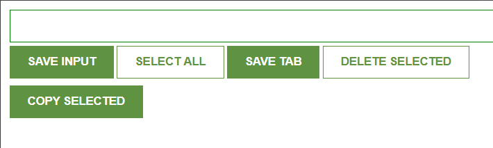

# Link-saver Chrome Extension README

## Table of Contents

1. [Introduction](#introduction)
2. [Features](#features)
   1. Direct Tab Saving
   2. Manual Link Entry
   3. Multiple Link Management
   4. Select and Copy/Delete Functionality
   5. Select-All Button
3. [Installation](#installation)
4. [Usage](#usage)
5. [Contributing](#contributing)
6. [License](#license)

## Introduction

Link-saver is a Chrome extension designed to help users easily save and manage website links. It provides a simple interface for capturing links directly from open tabs or manually entering them, allowing for efficient link organization and retrieval.
 

 

## Features

### Direct Tab Saving

- Automatically save the URL of the currently open tab with just one click.

### Manual Link Entry

- Enter any desired link manually using the provided text field.
- Supports saving multiple links at once by adding them sequentially.

### Multiple Link Management

- View all saved links in a centralized list.
- Easily select and manage individual links.

### Select and Copy/Delete Functionality

- Select multiple links for batch operations like copying or deleting.
- Quickly copy selected links to clipboard for easy sharing.

### Select-All Button

- Use the "Select All" button to choose every link at once for bulk operations.

## Installation

To install Link-saver locally on Chrome:

1. Clone this repository to your local machine.
2. Open Chrome and navigate to `chrome://extensions/`.
3. Enable "Developer mode" in the top right corner.
4. Click "Load unpacked" and select the folder containing the extension files.

## Usage

Once installed:

1. To save a tab's URL: Click the Link-saver icon in the toolbar.
2. To manually enter a link: Use the provided text field in the popup.
3. To manage links: View saved links in the popup window.
4. To copy or delete links: Select them using checkboxes and use the provided buttons.

## Contributing

Contributions to Link-saver are welcome! Please feel free to submit pull requests or open issues if you have any suggestions or find bugs.

## License

This project is licensed under the MIT License - see the [LICENSE](LICENSE) file for details.
